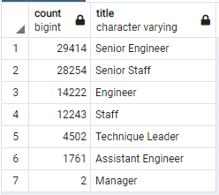
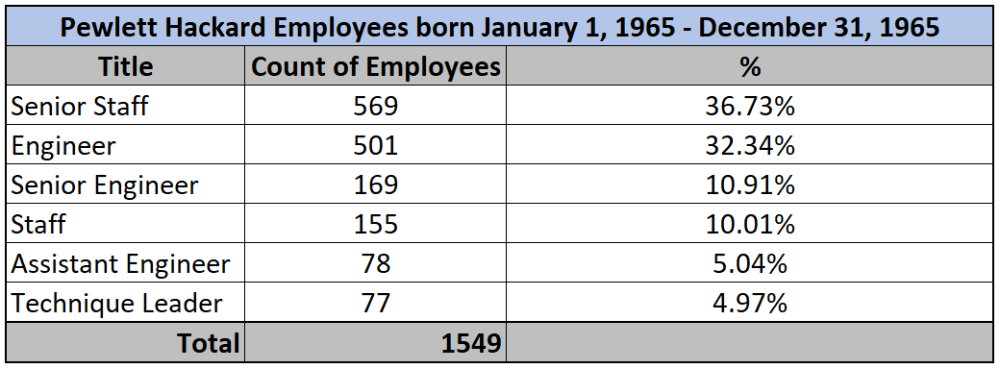

# Pewlett Hackard Analysis

## Overview of the Pewlett Hackard Analysis

### Purpose

##### The purpose of Module Seven and the Pewlett Hackard Analysis is to use Structured Query Language, most commonly referred to as SQL, in a Postgres relational database using pgAdmin.  In this module, an entity relationship diagram (ERD) was initially designed to organize employee data for six separate CSV files containing employees, departments, employees by department, managers by department, salaries, and titles information. The large CSV datasets were imported into pgAdmin and queries using joins, Where, Order By, Group By, Count, On, and Into clauses and functions, in addition to table aliases, were used to analyze the data.  The employee data was thoroughly analyzed to determine how many Pewlett Hackard employees are eligible for retirement and what programs need to be put into place for mentorship opportunities before retirement-eligible employees retire.

### Results

##### The results of the Pewlett Hackard Analysis determined the following:
- Overall, 90,398 employees are eligible for retirement.
- Senior Engineers are the majority of employees eligible for retirement at 32.54% or 29,414 employees.
- Senior Staff is the second most group of employees eligible for retirement at 31.26% or 28,254 employees.
- Engineers (15.73%), Staff (13.54%), Technique Leaders (4.98%), Assistant Engineers (1.95%), and Managers (less than 1%) are the least most groups of employees eligible for retirement.

### Summary

##### In summary, Pewlett Hackard has more than 220,000 active employees and 90,398 employees are eligible for retirement and these positions will need to be filled.  There are enough qualified retirement-ready employees to mentor employees if the mentees' birth dates are between January 1, 1965 and December 31, 1965.  Based on the mentorship_eligibility query which calculates how many employees were born between January 1, 1965 and December 31, 1965

